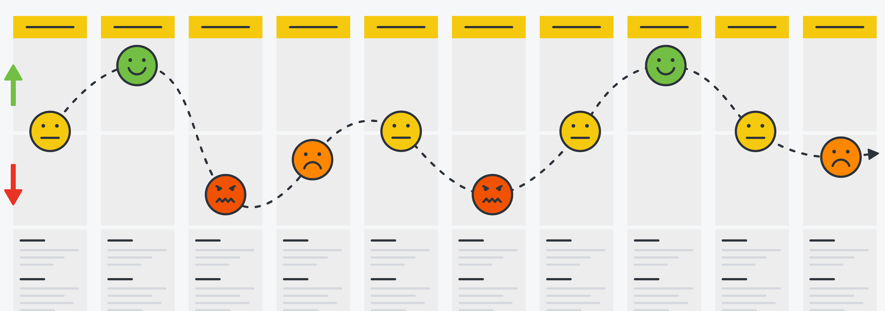
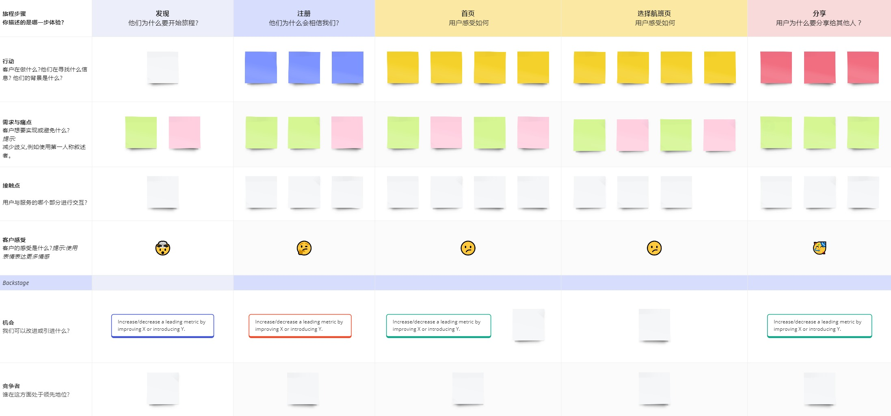

# 建立用户体验满意度模型

### 一、理解用户体验

在谈论用户体验时，我们不仅关注用户在接触我们的应用程序或网站时的感受，而是从他们接触我们的产品之前到离开之后的整个旅程。用户体验涵盖了许多定性的衡量标准，例如涉及到产品的功能性、美观性、可用性、性能以及情感共鸣等各个方面。因此，我为用户体验创建了以下定义：

> **“用户在所有渠道和设备上与产品或服务进行交互时的总体感知。”**

用户体验就是用户的旅程。这段旅程通常包含多个接触点，有时被称为“关键时刻”。要创造出色的用户体验，需要确保所有接触点在所有渠道、所有设备和所有用户上都得到优化。

而优化用户体验的关键在于全方位地考虑用户的需求和感受，确保他们在每一个接触点上都能获得一致且满意的体验。通过不断改进和优化这些接触点，我们能够提升用户的整体感知，从而实现更高的用户满意度和忠诚度。

我们对用户体验的理解，不应该局限于是网站或应用程序的虚拟体验，还包括物理世界的感知，比如乘客从进机场到离开的整个旅程中的体验，这不仅取决于飞机等硬件设施和空乘人员的服务，还有机场工作人员的引导。

简而言之，用户体验涵盖了用户在整个使用过程中与产品、服务及相关环境的所有互动和感受。这包括了数字化和物理环境中的各个接触点，确保用户在整个过程中感受到顺畅、愉悦和高效。

以上内容是笔者对用户体验更横向的理解，也是高级技术人员应该建立的正确的思维模型。

### 二、定义用户旅程

有了对用户体验更上层的理解之后，我们可以从用户的视角切入，进一步定义用户与产品互动的过程。
为了定义这一过程，我们需要回答下面三个问题：

- 用户与产品的第一次互动点是什么？
- 用户采取了哪些行动和步骤来实现最终目标？
- 用户在每个阶段的感受如何？

而用户旅程地图刚好可以帮助我们回答以上三个问题, UX 设计师一般使用可视化的工具创建用户旅程模板：

而创建一个详细的用户旅程地图大致需要以下 5 个步骤：

1. 定义用户角色和场景
2. 概述关键阶段、接触点和操作
3. 填写用户的想法、情绪和痛点
4. 识别改进机会
5. 定义行动点和下一步

比较关键的是第 2 步和第 3 步，将用户旅程分成几个高层阶段（stages），并在每个阶段中列出用户的具体操作和接触点（touchpoints）。接触点是用户与产品或服务互动的具体节点，如网站主页、客服聊天窗口、结账页面等。于是用户可能会有下面三种感知：

- 想法：用户在浏览产品页面时可能会想：“这个产品有学生折扣吗？”
- 情绪：用户可能在找到合适产品时感到兴奋，但在结账过程中遇到问题时感到沮丧。
- 痛点：用户在结账时可能发现支付选项有限，或者填写信息的过程过于复杂。

在实际应用中，用户旅程地图可以用于各种场景，比如：

- 购票网站：绘制用户从首次访问网站到最终完成购买的全过程，包括搜索产品、查看详情、加入购物车、结算付款等步骤。
- 聊天应用：展示用户从下载应用到创建个人资料、加好友、发送消息等的全过程。

而对于开发人员来说，我们需要识别是用户在交互过程中，产品的实际表现，比如核心业务的交互性能、页面加载性能、程序异常导致的业务中断等等。这些都是需要开发人员与 UX 设计师合作在用户旅程图中去识别的。下面我们基于用户旅程图，去识别影响用户体验的关键因素。

### 三、识别体验因子

在单次的用户旅程中，开发人员需要识别出左右用户情绪的因素有哪些，这些因素我们在这里给它们取个名字叫：**体验因子**，后面你会发现，这些因子正是影响用户体验的关键。
笔者梳理了最常遇到的体验因子，并根据其中相似的特性，将这些因子归类，分为：

| 类别     | 体验因子                                                                                                                                                             |
| -------- | -------------------------------------------------------------------------------------------------------------------------------------------------------------------- |
| 交互性能 | 首屏性能、交互性能、页面滚动流畅度、动画性能、视觉稳定性、表单填写流畅度、用户界面直观性、导航易用性、一致性和标准化、帮助和支持的可用性、错误信息清晰度、无障碍访问 |
| 超长等待 | http 请求等待时间、资源加载等待时间、长任务                                                                                                                          |
| 异常信号 | JS 错误、跨域错误、资源错误、 接口错误、 白屏错误                                                                                                                    |

我拆分的理由如下：

1. **交互性能**：交互体验评估的是用户与页面交互带来的情绪波动，并且这里的交互不仅仅指用户的操作点击，用户主动发起进入页面的行为也算交互，这是一种更广义的交互。

2. **超长等待**：专门针对用户在操作过程中经历的等待时间。长时间的等待会直接影响用户的情绪

3. **异常信号**：包括系统错误、崩溃和访问问题等因子。这类问题通常会导致严重的用户不满和流失，因此单独归类便于重点关注和改进。

在第一类用户交互体验中，交互响应快会让用户感到满意；响应慢则可能让用户感到困扰或沮丧；超长的等待时间只能带来困扰或沮丧的负面体验因子；同理，异常信号则只会让用户感到沮丧。

| 用户交互体验 | 满意 | 可接受 | 沮丧 |
| ------------ | ---- | ------ | ---- |
| 交互性能     | ✅   | ✅     | ✅   |
| 超长等待时间 |      | ✅     | ✅   |
| 异常信号     |      |        | ✅   |

### 四、建立满意度模型

基于上一节识别出的体验因子和情绪类别，可以将二者结合，举个例子：

首次内容绘制时间，这是一个关于交互性能的体验因子，它具备满意、可接受、沮丧三种情绪， 当小于 2s 时，我们可以认为是另用户满意的，当在 2s-4s 之间时，是用户可接受的范围，而加载时间大于 4s 时，会让用户感到沮丧。

| 性能指标 | 满意     | 可接受          | 沮丧     |
| -------- | -------- | --------------- | -------- |
| FCP      | < 2000ms | 2000ms - 4000ms | > 4000ms |

“首次内容绘制时间”这个指标在评估用户体验时，我们会根据实际的用户情绪反馈赋予不同的权重，用户和高层希望看到某个页面快速的首屏加载，那么这个指标的重要性相对较高，于是当首次内容绘制时间 > 4000ms 时，用户体验是沮丧的，在整个用户旅程中对体验的影响程度较高，于是我们需要给每种情绪赋予不同的权重，来表示对用户体验的影响程度：

我们设置权重为0-5之间，0表示对用户体验影响极小或无影响，从0开始影响程度逐步递增：

| 交互性能 | 满意     | 权重 | 可接受          | 权重 | 沮丧     | 权重 |
| -------- | -------- | ---- | --------------- | ---- | -------- | ---- |
| FCP      | < 2000ms | 3    | 2000ms - 4000ms | 3    | > 4000ms | 5    |
| 累计布局偏移      | < 0.1 | 3    | 0.1-0.25 | 3    | > 0.25 | 3    |

| 超长等待 | 满意     | 权重 | 可接受          | 权重 | 沮丧     | 权重 |
| -------- | -------- | ---- | --------------- | ---- | -------- | ---- |
| Http请求      | < 1000ms | 0    | 1000ms - 3000ms | 3    | > 3000ms | 3    |

而异常信号只能导致沮丧，对用户体验影响很大，因此权重较高。

| 异常信号                       | 权重 |
|-------------------------------|------|
| JS 错误                       | 5    |
| 资源错误                      | 5    |
| 数量超限                      | 5    |
| 白屏错误                      | 5    |

现在我们有了整个用户旅程的体验评价标准，接下来要做的就是收集数据了，而数据的收集我们会单独一章来讲解。

假设某次用户旅程的具体数据如下：

| 指标 | 实际数值 | 分类 | 权重 |
| --- | --- | --- | --- |
| 累计布局偏移 | 0.2 | 可接受 | 3 |
| 首次内容绘制时间 | 5000ms | 沮丧 | 5 |
| 最大内容绘制时间 | 2000ms | 可接受 | 3 |
| HTTP 时长 | 4000ms | 沮丧 | 3 |

根据收集到的数据使用公式：
     \[
     \text{因子权重占比} = \frac{\text{沮丧因子权重}}{\text{所有因子权重总和}} \times 100\%
     \]

最后计算沮丧因子总权重的百分比：
\[
\text{沮丧因子总权重占比} = \frac{8}{14} \times 100\% = 57.14\%
\]

不同的百分比对应不同的用户体验等级（可以根据自身实际项目情况在此基础上细化等级。）例如：

- 满意：沮丧因子总权重占比 < 40%
- 一般：沮丧因子总权重占比在40%-50%之间
- 沮丧：沮丧因子总权重占比 > 50%

可以看到，57.14\%对应的是沮丧，那么说明整个用户旅程是令人沮丧的，研发可以从中看到用户体验的沮丧程度，帮助研发分析用户诅丧的原因，从而进行更定向的优化，

### 5、总结
用户体验不仅涵盖用户使用应用程序或网站时的感受，还包括他们从接触产品前到使用后的整个旅程，开发者需要建立正确的用户体验思维模型，本文详细介绍了如何创建用户旅程地图，通过与UX设计师合作创建用户旅程地图，可以识别和优化用户在每个接触点的体验。我们将体验因子分为交互性能、超长等待和异常信号三大类，每类因子对用户情绪有不同影响。最后本文重点讲解了如何建立满意度模型，通过这些因子和用户情绪的权重，量化用户体验，从而不断改进和提升整体用户满意度。

