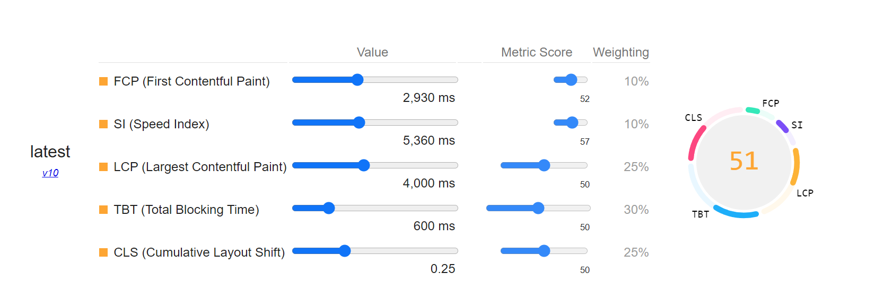
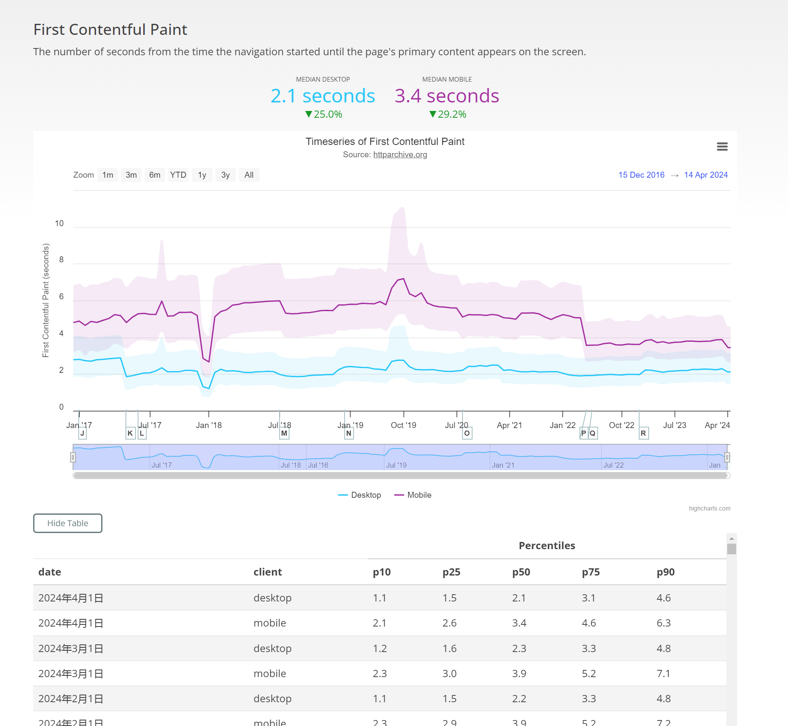
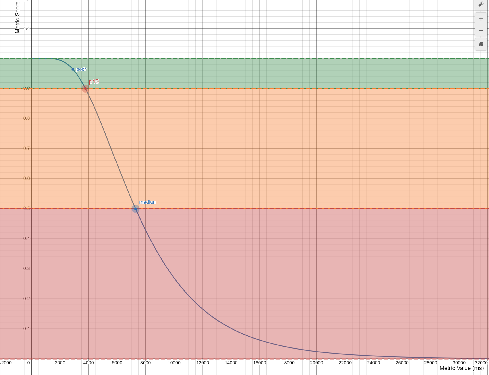

# 如何建立有效的性能评分模型



上图的是[Lighthouse Scoring Calculator](https://googlechrome.github.io/lighthouse/scorecalc/)（性能指标计算器），用于帮助用户了解各项指标在不同的值时在总评分中的权重和影响。下面我简要介绍上图中各项指标的含义：

### 1、指标及其含义

Lighthouse 性能评分由以下几个关键指标组成，每个指标都有其特定的权重，这些权重决定了它们对总性能评分的影响：

1. **FCP**：从导航开始到浏览器渲染出第一个内容（例如文本或图像）的时间，反映页面加载的初步响应能力。
2. **SI**：页面内容在视窗内加载的速度。衡量页面内容视觉上加载的速度。
3. **LCP**：从导航开始到主视窗内最大内容元素开始渲染的时间，衡量主要内容加载的速度。
4. **TBT**：FCP 到 TTI 之间所有长任务（任务超过 50ms）的阻塞时间总和，衡量页面在加载过程中阻塞主线程的时间。
5. **CLS**：页面生命周期内所有意外布局偏移的累积分数。衡量页面视觉稳定性，防止内容在加载过程中突然移动。

上面的每个指标后面的数据有三种：

- **Value**：表示该指标的实际测量值，毫秒为单位。
- **Metric Score**：表示根据其数值转换为 0 到 100 的评分，这个评分表示指标在特定区间内的表现。
- **Weighting**：表示该指标的权重占比，直接说明该指标对总性能评分的相对重要性。

而最右边的数字 51 表示：每个指标的评分按照其权重加权计算出的总性能评分，范围为 0 到 100。

### 2、数据指标如何收集

单独看某个网站的 FCP、CLS 等关键性能数据是没有任何意义的，因为没有一个**可供量化衡量的客观标准**。什么样的数据就能算好的性能，什么样的数据是较差的性能，是需要根据大量的数据反馈决定的。你需要知道你的网页的性能指标处于什么样的位置，是中等偏上，还是一般。当然，你也可以自己定义，但依然会有一个具有一般参考意义的客观标准。那这些标准从哪里来呢？

**HTTP Archive** 是一个记录和存储全球热门网站历史数据的非营利项目，目前每月跟踪并分析全球数百万个网站的数据。这些数据包括但不限于：页面加载时间、页面大小、使用的技术（如框架和库）、无障碍等。Lighthouse 会参考 [HTTP Archive](https://httparchive.org/) 记录的历史性能数据，定期更新数据指标来保持其性能评估工具的前瞻性和准确性，以确保开发者能够获得最新、最相关的性能优化建议。

我们拿 FCP 为例：


以上是 HTTP Archive 记录的从 2018 年 8 月 1 日到 2024 年 5 月 1 日的历史 FCP 数据。我们可以看到数据是随时间不断波动的，这就意味着 Lighthouse 最终计算的总得分也是随时间波动的。原因在于诸多因素的影响：页面包含非确定性逻辑、本地网络的延迟、加载网页的硬件、不同浏览器的非确定性等。因此，即使代码没有变化，Lighthouse 性能评分也会发生变化。**单一的分数不能全面反映用户在不同环境中的真实体验**，因此我们对网站性能得分更好的理解是：

> 网站性能视为得分的分布而非单个数字。

就像考试一样，每次考的分数可能不同，但你可以看到自己是否进步了。因此，计算性能指标在整个分布中的相对位置，有助于我们更好地评价性能。

### 3、对性能指标进行数学建模

要建立一个合理的评分模型需要将实际性能指标映射到一个感知友好的评分范围（0 到 100 分），这涉及到用户如何感知性能的变化。我们注意到：用户对网站性能变化的感知并不是线性的。

当网页性能较差（如 10 秒加载时间）时，性能改进带来的用户感知提升非常显著。例如，从 10 秒减少到 5 秒，用户明显会觉得网站快了很多，因为他们的等待时间减半了。当网页性能已经较好（如 2 秒加载时间）时，进一步的改进带来的感知提升较小，例如，从 2 秒减少到 1 秒，尽管在绝对时间上减少了 1 秒，但对用户体验的提升不显著。

随着网页性能的逐步提升，每一单位的改进对用户体验的提升都会减小，表现为对数正态分布。这便是 Weber–Fechner 定律，它描述了感知与实际刺激之间的关系。它指出，感知变化的强度与实际刺激变化的比例成对数关系，而不是线性关系。具体公式为：

$$
S = k \cdot \log(I)
$$

其中： \( S \) 是感知的强度、 \( I \) 是实际刺激的强度、 \( k \) 是一个常数。
通过使用对数正态分布，Lighthouse 能够将性能的实际变化转换为用户感知的变化，从而提供更直观的评分。

不仅如此，在实际的网页性能统计中，我们经常会发现大多数网页的性能指标（如加载时间、交互延迟等）集中在一个较小的范围内，但有少数网页的性能表现非常糟糕，形成长尾效应。而对数正态分布非常适合于描述这种非负且有偏的数据，尤其是当数据集中在一个区域，但在某一端（通常是右端）有长尾延伸时。

#### 3.1 确定对数正态分布的形状

对数正态分布是这样的一个分布：当一个随机变量 \(X\) 的对数 \( log(X) \) 服从正态分布时，\(X\) 就是对数正态分布的。它主要由两个参数来描述：

1. **位置参数 ($\mu$)**：这个参数是对数尺度上分布的中心位置，通常用中位数的对数来表示。

$$
\mu = \log(\text{median})
$$

2. **形状参数 ($\sigma$)**：对数尺度上数据的分散程度，描述了分布的宽度和形状。

在对数正态分布中，性能数据的较大部分集中在中位数附近，但也存在一些极端值（长尾部分）。因此，Lighthouse 会具体参考 [HTTP Archive](https://httparchive.org/) 的中位数 (median) 和第 10 百分位数 (p10)，分别用于计算位置参数和形状参数。

具体代码实现为：

```javascript
function derivePodrFromP10(median, p10) {
   //计算位置参数
  const u = Math.log(median);
  // 计算形状参数
  const shape = Math.abs(Math.log(p10) - u) / (Math.SQRT2 * 0.9061938024368232);
  const inner1 = -3 * shape - Math.sqrt(4 + shape * shape);
  // 计算得到podr
  const podr = Math.exp(u + shape/2 * inner1)
  return podr;
}
```

最终得到的 PODR（Point of Diminishing Returns）的值可以确定对数正态分布的形状，原因在于它确定了边际效应递减的拐点。我们可以通过下图看出三个控制点的关系：



上图中的 **横轴（Metric Value）**：表示性能指标的实际值（如加载时间，单位为毫秒），**纵轴（Metric Score）**：表示性能指标对应的得分，范围通常在 0 到 1 之间，反映了性能从差到好的程度。

#### 3.2 PODR 的意义

PODR（收益递减点）位于曲线的左侧，靠近性能得分较高的部分。这意味着：

- **初始阶段的显著改进**：在 PODR 点的右边，性能较差的部分进行优化，通常能带来显著的改进。例如，加载时间从 5000 毫秒减少到 3000 毫秒，用户会明显感觉到提升。
- **PODR 之后的收益递减**：一旦性能达到 PODR，进一步的优化虽然仍有提升，但边际效应递减。例如，从 2000 毫秒进一步优化到 1000 毫秒，用户感知到的提升不如前

者显著。随着性能逐渐接近最优状态，每单位的改进所带来的用户体验提升会越来越小。

#### 3.3 图表中的区域颜色

- **绿色区域**：代表性能最好的部分，用户体验较优，优化的边际效应较小。
- **橙色区域**：代表性能中等的部分，用户体验有所下降，但优化的边际效应较大，改进能显著提升得分。
- **红色区域**：代表性能较差的部分，用户体验最差，虽然优化有明显的提升，但到达一定程度后边际效应递减。

### 4、从指标数据到评分

在确定了整个评分模型曲线的形状之后，我们需要将具体的性能数据映射到一个范围为 [0, 1] 的标准化得分。这涉及到将不同的性能数据映射到一个统一的尺度上，从而便于比较和分析。为此，我们需要将对数正态分布的数据转换为标准正态分布：

#### 4.1 转换过程

1. **计算形状参数**

首先，通过 PODR 和中位数计算形状参数 ($a$)（即 $\sigma$）：

- **中位数 ($m$)**：对数正态分布的中位数，用于计算位置参数 ($\mu$)。
- **PODR ($s$)**：收益递减点，用于确定形状参数 ($\sigma$)。

使用给定的公式计算形状参数：

$$
a = \frac{1}{2} \sqrt{1 - 3 \ln\left(\frac{s}{m}\right) - \sqrt{\left(\ln\left(\frac{s}{m}\right) - 3\right)^2 - 8}}
$$

```javascript
var logRatio = Math.log(podr / median);
var shape = Math.sqrt(1 - 3 * logRatio - Math.sqrt((logRatio - 3) * (logRatio - 3) - 8)) / 2;
```

2. **对数转换**

将具体的性能数据 ($x$)（如加载时间）进行对数转换：

$$
\log(x)
$$

```javascript
var location = Math.log(median);
```

3. **标准化值（z 值）**

将对数变换后的性能值标准化，计算其在标准正态分布中的位置（z 值）：

$$
z = \frac{\log(x) - \log(m)}{a \sqrt{2}}
$$

其中，log(m) 是对数中位数 ($b$)，($a$) 是通过 PODR 计算得到的形状参数。

```javascript
var standardizedX = (Math.log(value) - location) / (Math.SQRT2 * shape);
```

4. **使用误差函数计算 CDF**

通过高斯误差函数（erf）将标准化值（z 值）转换为累积分布函数值（CDF），它能将标准正态分布中的标准化值（z 值）转换为一个范围在 [0, 1] 之间的概率值。

$$
C(x) = \frac{1}{2} \left(1 + \text{erf} \left(\frac{\log(x) - \log(m)}{a \sqrt{2}}\right)\right)
$$

完整代码实现如下：

```javascript
export function QUANTILE_AT_VALUE({median, podr, p10}, value) {
  if (!podr) {
    podr = derivePodrFromP10(median, p10);
  }
  var location = Math.log(median);
  var logRatio = Math.log(podr / median);
  var shape = Math.sqrt(1 - 3 * logRatio - Math.sqrt((logRatio - 3) * (logRatio - 3) - 8)) / 2;

  var standardizedX = (Math.log(value) - location) / (Math.SQRT2 * shape);
  return (1 - internalErf_(standardizedX)) / 2;
}
```

以上代码中的函数 `internalErf_` 用于近似计算高斯误差函数 ($\text{erf}(x)$)，其定义为：

$$
\text{erf}(x) = \frac{2}{\sqrt{\pi}} \int\_0^x e^{-t^2} , dt
$$

这是一个已知的基于 Abramowitz 和 Stegun 的近似公式，用于高精度计算误差函数。代码实现如下：

```javascript
function internalErf_(x) {
  // erf(-x) = -erf(x);
  var sign = x < 0 ? -1 : 1;
  x = Math.abs(x);

  var a1 = 0.254829592;
  var a2 = -0.284496736;
  var a3 = 1.421413741;
  var a4 = -1.453152027;
  var a5 = 1.061405429;
  var p = 0.3275911;
  var t = 1 / (1 + p * x);
  var y = t * (a1 + t * (a2 + t * (a3 + t * (a4 + t * a5))));
  return sign * (1 - y * Math.exp(-x * x));
}
```

最终，我们通过 QUANTILE_AT_VALUE 函数将性能指标映射到一个统一的 [0, 1] 得分上，并且也能反映用户对性能改进的实际感知。以上便是 Lighthouse 基于用户体验感知建立数学模型，通过误差函数和累积分布函数（CDF）实现性能数据标准化评分的整体思路。

### 5、建立有效的性能评分模型

我们可以在 Lighthouse 的基础上根据业务场景进行更定制化的性能评分：

#### 1. 数据清洗

收集产品的性能参数，进行适当的数据清理和预处理，清理异常值和噪声，进行对数变换。通过统计方法或机器学习算法，识别并处理异常值（outliers），防止其对模型产生不良影响。

#### 2. 多维度评估

通过对不同页面应用不同标准进行分级评估，意味着针对网站或应用中不同类型的页面，设定不同的性能指标标准，并根据这些标准对页面进行分类和评估。这样做的目的是考虑到不同页面的特性和用户期望的不同，从而更加准确地评估每个页面的性能和用户体验。

比如定义等级 1:

- **FCP Good**: 1500ms
- **FCP Bad**: 3000ms
- **LCP Good**: 2000ms
- **LCP Bad**: 4000ms

等级 2:

- **FCP Good**: 1800ms
- **FCP Bad**: 3500ms
- **LCP Good**: 2500ms
- **LCP Bad**: 4500ms

在实际评估中，我们可以对每个页面的 FCP 和 LCP 进行测量，并根据设定的标准将其归入相应的级别。以下是一个示例评估结果：

- **首页（赋予等级 1）**:
  - 实测 FCP: 1600ms （介于 Good 和 Bad 之间）
  - 实测 LCP: 2100ms （介于 Good 和 Bad 之间）
  - 评估结果：中等

- **商品详情页（赋予等级 2）**:
  - 实测 FCP: 1700ms （Good）
  - 实测 LCP: 2600ms （介于 Good 和 Bad 之间）
  - 评估结果：良好

- **结算页（赋予等级 1）**:
  - 实测 FCP: 1100ms （Good）
  - 实测 LCP: 1600ms （Good）
  - 评估结果：优秀

通过这样的分级评估，我们可以更清晰地了解每个页面的性能表现，找到需要优化的页面和具体的优化方向。例如，如果商品详情页的 LCP 较差，可能需要优化图片加载或减少大型资源的加载时间。

#### 3. 动态调整参数

根据收集产品的性能参数，比如 web-vitals 收集到的性能指标，定期调整模型参数，比如 p10 和 median，确保模型评分能正确反映当下的性能趋势。

将以上文章的数学符号格式，改为 GitHub 支持的。
