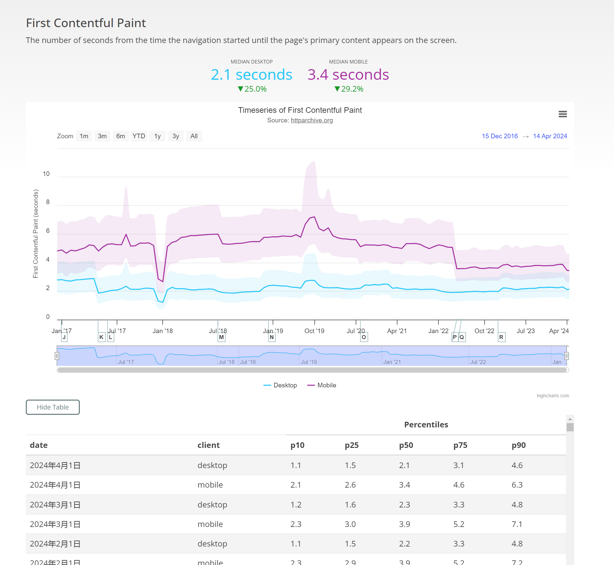

# lighthouse 指标得分原理

上图的是[Lighthouse Scoring Calculator](https://googlechrome.github.io/lighthouse/scorecalc/)(性能指标计算器)，用于帮助用户了解各项指标在不同的值时在总评分中的权重和影响。下面我简要介绍上图中各项指标的含义：

### 指标及其含义

Lighthouse 性能评分由以下几个关键指标组成，每个指标都有其特定的权重，这些权重决定了它们对总性能评分的影响：

1. **FCP**：从导航开始到浏览器渲染出第一个内容（例如文本或图像）的时间，反映页面加载的初步响应能力。
2. **SI**：页面内容在视窗内加载的速度。衡量页面内容视觉上加载的速度
3. **LCP**：从导航开始到主视窗内最大内容元素开始渲染的时间，衡量主要内容加载的速度
4. **TBT**：FCP 到 TTI 之间所有长任务（任务超过 50ms）的阻塞时间总和，衡量页面在加载过程中阻塞主线程的时间
5. **CLS**：页面生命周期内所有意外布局偏移的累积分数。衡量页面视觉稳定性，防止内容在加载过程中突然移动

上面的每个指标后面的数据有三种：

- **value**：表示该指标的实际测量值，毫秒为单位
- **Metric Score**：表示根据其数值转换为 0 到 100 的评分，这个评分表示指标在特定区间内的表现，
- **Weighting**：表示该指标的权重占比，直接说明该指标对总性能评分的相对重要性

而最右边的数字 51 表示：每个指标的评分按照其权重加权计算出的总性能评分，范围为 0 到 100。

### 数据指标如何收集

单独看某个网站的 FCP、CLS 等关键性能数据是没有任何意义的，因为没有一个**可供量化衡量的客观标准**，什么样的数据就能算好的性能，什么样的数据是较差的性能，是需要根据大量的数据反馈决定的，你需要知道你的网页的性能指标处于什么样的位置，是中等偏上，还是一般，当然你也可以自己定义，但依然会有一个具有一般参考意义的客观标准。那这些标准从哪里来呢？

**HTTP Archive** 是一个记录和存储全球热门网站历史数据的非营利项目，目前每月跟踪并分析全球数百万个网站的数据，这些数据包括但不限于：页面加载时间、页面大小、使用的技术（如框架和库）、无障碍等。Lighthouse 会参考[HTTP Archive](https://httparchive.org/)记录的历史性能数据，定期更新数据指标来保持其性能评估工具的前瞻性和准确性，以确保开发者能够获得最新、最相关的性能优化建议。

我们拿 FCP 为例：

以上是 HTTP Archive 记录的从 2018 年 8 月 1 日到 2024 年 5 月 1 日的历史 FCP 数据，我们可以看到数据是随时间不断波动的，也就意味着 Lighthouse 最终计算的总得分也是随时间波动的，原因在于诸多因素的影响：页面包含非确定性逻辑、本地网络的延迟、加载网页的硬件、不同浏览器的非确定性等，因此即使代码没有变化，Lighthouse性能评分也会发生变化，**单一的分数不能全面反映用户在不同环境中的真实体验**，因此我们对网站性能得分更好的理解是：

> 网站性能视为得分的分布而非单个数字

就像考试一样，每次考的分数可能不同，但你可以看到自己是否进步了

### 对数据指标进行数学建模

在实际的网页性能分析中，我们经常会发现大多数网页的性能指标（如加载时间、交互延迟等）集中在一个较小的范围内，但有少数网页的性能表现非常糟糕，形成长尾效应。

举个例子：大多数用户可能使用的是高速、稳定的网络连接，例如家用光纤、4G/5G移动网络等。这些网络环境能够保证网页资源的快速加载和响应。因此，对于大多数用户来说，网页的加载时间和交互延迟会比较短，集中在一个较小的范围内。

而 Lighthouse 会具体参考[HTTP Archive](https://httparchive.org/)中的哪些数据呢？

`median、p10`

在统计学中 median、p10 描述一组数据的分布和集中趋势：

1. **中位数 (median)**：将所有数据按顺序排列后正中间的值。与平均值不同，中位数不容易受到极端值（非常快或非常慢的加载时间）的影响，因此可以更真实地反映出大多数页面的性能水平。
2. **第 10 百分位数 (p10)**：有10%的样本数据小于或等于1800毫秒

